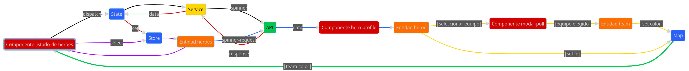

# Diagrama de dominio
[Enlace al diagrama](https://www.mermaidchart.com/app/projects/ee4f30ea-d8c0-48be-b78c-035f0a74990c/diagrams/bc401bc3-43ac-4bf7-be8f-770af99f5c5a/version/v0.1/edit)
Requiere hacer login para poder verlo con zoom

Los colores de las lineas representan distintas etapas del flujo para hacerlo mas entendible

* linea negra: peticion desde el componente listado-de-heroes hasta llegar a la API
* linea roja: respuesta de la API hasta ser almacenada en el store
* linea violeta: llamada del componente listado-de-heroes hasta tener la data para desplegar los heroes
* linea azul: desde que se clickea en un heroe de la lista para visualizarlo en hero-profile
* linea amarilla: desde el hero-profile hasta que se guarde su equipo en el map
* linea verde: información del color del equipo del heroe para ser mostrado en el listado

        
        
## Explicación paso a paso del flujo:

1.-Componente listado-de-heroes despacha una acción: El componente listado-de-heroes dispara una acción hacia el State.

2.-State interactúa con el Service: El State interactúa con el Service para obtener los datos de los héroes de la API.

3.-Spinner indica carga: Mientras se espera la respuesta de la API, se muestra un spinner para indicar la carga.

4.-API devuelve data y actualiza el Store: La API devuelve la información de los héroes en la respuesta. El Service envía la data al State, y este a su vez actualiza el Store con dicha información.

5.-Componente listado-de-heroes obtiene data: El componente listado-de-heroes obtiene la data actualizada del Store que contiene la lista de héroes.

6.-Listado de héroes se muestra: La data obtenida se utiliza para mostrar la lista de héroes en el componente.

7.-Selección de héroe y activación del spinner: Al seleccionar un héroe específico, se activa un spinner nuevamente para indicar la carga de su información.

8.-Datos del héroe se obtienen de la API: Se realiza una petición a la API para obtener la información detallada del héroe seleccionado.

9.-Componente hero-profile muestra información: La data del héroe se envía al componente hero-profile y se utiliza para mostrar sus detalles.

10.-Selección de equipo en modal-poll: En el componente modal-poll, el usuario selecciona un equipo para el héroe.

11.-Actualización simultánea de ID y color en el Map: Tanto el ID del héroe como el equipo elegido se envían al Map de forma simultánea.

12.-Listado-de-heroes obtiene el color del equipo: El componente listado-de-heroes obtiene el color del equipo del Map basado en la selección previa.

13.-Actualización del color del héroe en la lista: El color del equipo obtenido se utiliza para actualizar la visualización del héroe en la lista del componente listado-de-heroes.

